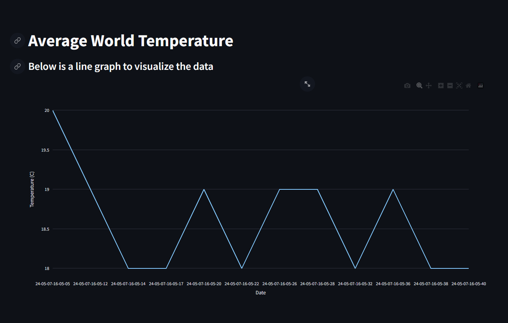

# TemperatureDataWebScraper
This project was made to practice web scraping and using a database to manage data instead of just using a text file. The data is then visualized using a line graph by using the plotly library and then implemented in a web app using streamlit . The database engine that is being used is SQLite.
Below is the preview of the web app
